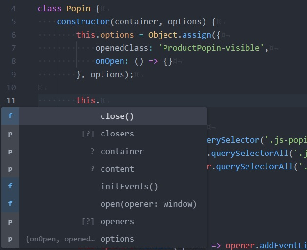
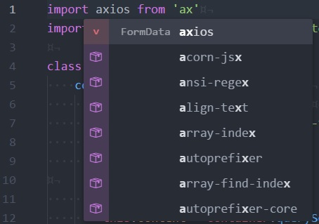
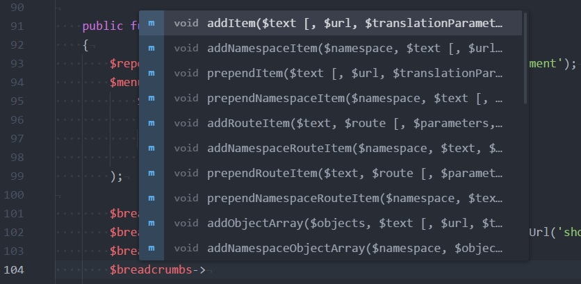
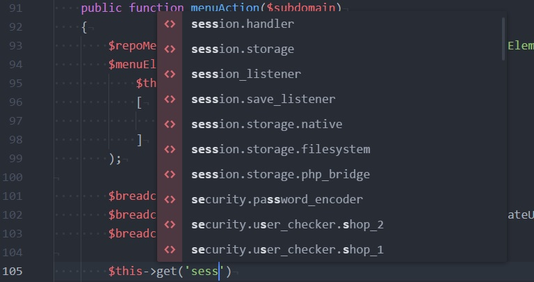

Il y a un peu plus de 2 ans, j'expliquais pourquoi [je préfère les éditeurs de
texte légers aux gros IDE](/articles/sublime-text-ide-a-la-carte/).  C'est
toujours le cas, à la différence près que j'ai abandonné Sublime Text pour
Atom. Cette préférence a un inconvénient qui découle d'un avantage majeur : il
n'y a pas de véritable autocomplétion pré-packagée. Evidemment, puisque dans ce
genre d'éditeur, l'intégration de fonctionnalités spécifique est laissée à
l'appréciation de l'utilisateur. Intégrer de l'autocomplétion pour les langages
qu'on utilise n'a rien de complexe, il faut juste prendre 5 minutes pour s'y
pencher. De mon côté, j'ai besoin d'autocomplétion sur du JavaScript, du PHP et
le framework Symfony.

## La base : `autocomplete-plus`

[`autocomplete-plus`](https://atom.io/packages/autocomplete-plus) est le
provider de base de toute autocomplétion dans Atom. Celui-ci est prépackagé
avec Atom. Il propose de base un provider simple, le `SymbolProvider` qui
propose une autocomplétion basée sur les "symboles" (en gros, les mots)
présents dans le fichier en cours d'édition.

Ce package est la base car il propose une API sur laquelle d'autres providers
peuvent venir s'appuyer pour proposer une autocomplétion plus spécifique et
efficace. Et les providers sont nombreux. Pour s'en convaincre, il suffit de
faire une [petite recherche sur le site
d'Atom](https://atom.io/packages/search?utf8=%E2%9C%93&q=autocomplete).

## De l'autocomplétion JavaScript

En JavaScript, on a besoin d'autocomplétion pour le langage en général
(classes, fonctions, variables...), mais aussi pour l'import de modules.

### L'autocomplétion "classique"

Pour ça, on va utiliser [`atom-ternjs`](https://atom.io/packages/atom-ternjs)
qui se base sur [Tern](https://github.com/ternjs/tern) et `autocomplete-plus`
pour fournir une autocomplétion très efficace pour JavaScript.

Tern doit être configuré pour chaque projet, ce qui nous laisse la main pour
définir les librairies externes qu'on veut utiliser. En effet, Tern est capable
de nous proposer de l'autocomplete pour l'API de jQuery, d'AngularJS, NodeJS
(et bien d'autres) si on le lui demande. Cette configuration peut bien
évidemment évoluer au cours de la vie du projet. Il suffira alors de modifier
le fichier de configuration en y ajoutant ou en enlevant les plugins souhaités.

### L'autocomplétion d'import de modules

Pour ne pas avoir à se souvenir de tous les noms des modules qu'on utilise, on
va utiliser
[`autocomplete-modules`](https://atom.io/packages/autocomplete-modules). Ce
package analyse notre dossier `node_modules` et nous propose les noms des
modules qui s'y trouvent lorsqu'on est en train de taper un `require('toto')`
ou un `import toto from 'toto'`. Il nous propose aussi nos modules locaux si le
nom qu'on est en train de taper commence par `./` ou `../`.

## De l'autocomplétion PHP

Pour PHP, comme pour JavaScript, on a bien entendu besoin d'une autocomplétion
générale pour l'ensemble du langage. Mais puisque je travaille majoritairement
avec le framework Symfony, j'ai aussi besoin de choses propres à celui-ci, pour
le nom des services par exemple.

### L'autocomplétion générale

Pour l'autocomplétion générale en PHP,
[`atom-autocomplete-php`](https://atom.io/packages/atom-autocomplete-php) fait
un très bon travail. Celui-ci s'appuie sur Composer et les blocs de
documentation présents dans le code. Pour qu'il fonctionne, il faut spécifier
le chemin vers votre Composer et votre PHP. Les deux autres paramètres
"Autoload file" et "Classmap files" peuvent être laissés à leur valeur par
défaut pour une utilisation classique de Composer.

### L'autocomplétion Symfony

Ici, c'est sur [`atom-symfony2`](https://atom.io/packages/atom-symfony2) qu'on
va compter. Celui-ci propose de l'autocomplétion sur différentes choses.
D'abord, dans les fichiers de configuration, il propose de l'autocomplétion sur
les noms de services et sur les classes. Ensuite, dans une classe utilisant le
conteneur d'injection de dépendance, celui-ci propose de l'autocomplétion sur
les noms de services.

Pour fonctionner, celui-ci nécessite qu'on ait installé
`atom-autocomplete-php`, que celui-ci soit fonctionnel, et qu'on ait bien
spécifier le chemin du fichier `console` dnas la configuration. Pour ce dernier
détail, si on travaille avec Symfony 2, on peut laisser la valeur par défaut
(`app/console`). Mais si on travaille avec Symfony 3, il faut spécifier le
nouvel emplacement de ce fichier : `bin/console`.

Et voici. Pour avoir de l'autocomplete sur d'autres langages, il vous suffit de
trouver et d'installer un plugin pour le ou les langages qui vous intéressent.
Il y a très peu de chance qu'un tel plugin n'existe pas déjà.

Petit bonus, pour ne pas avoir à installer les mêmes packages deux fois (au
boulot et à la maison), vous pouvez utiliser
[`sync-settings`](https://atom.io/packages/sync-settings).
