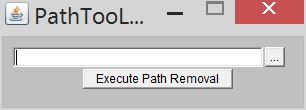
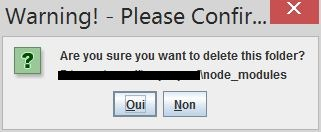
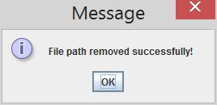

Quand on travaille avec npm sous windows, on est souvent confronté au message
d'erreur suivant lorsqu'on veut supprimer un module non utilisé ou le dossier
`node_modules` pour quelque raison que ce soit : "Les noms de fichiers source
sont plus longs que ne le permet le système de fichiers. Choisissez un
emplacement de destination avec un nom plus court, ou donnez des noms plus
courts aux fichiers avant de les déplacer". Il existe un petit outil qui permet
de passer outre cette restriction.

<span class="more"></span>

Edit 22/01/2016 : il existe en fait une solution un peu plus simple, dont je
dois la découverte à un collègue (qu'il doit lui-même au web). Il s'agit
d'utiliser la commande `robocopy`, disponible depuis Windows XP, pour
"remplacer" le dossier `node_modules` par un dossier vide :

```bash
robocopy <chemin vers un dossier vide> <chemin vers node_modules> /MIR
```

[Source](http://www.michael-whelan.net/deleting-nested-node-modules-folders/).

Si cette solution ne fonctionne pas pour vous pour n'importe quelle raison, il
reste la suivante.

C'est OSMStudios qui fournit
[PathTooLong](http://osmstudios.net/projects/path-too-long), écrit en Java, et
qui permet tout simplement de sélectionner un dossier dont le chemin est trop
long pour être supprimé par windows, et le supprimer pour de bon.

Il suffit de télécharger le fichier JAR et de l'exécuter avec un JDK 1.7 ou
plus :

```bash
java -jar PathTooLong.jar
```



Une fenêtre s'ouvre, il ne vous reste plus qu'à sélectionner le dossier à
supprimer, à confirmer la suppression et attendre plus ou moins longtemps en
fonction de la taille de celui-ci. Un message de succès s'affiche une fois le
dossier supprimé.





Attention, comme l'indique le message vous demandant de confirmer la
suppression, celle-ci est définitive. Les fichiers ne passeront pas par la
corbeille.

Pour les sceptiques, le code source est disponible sur
[GitHub](https://github.com/DawsonG/PathTooLong).
